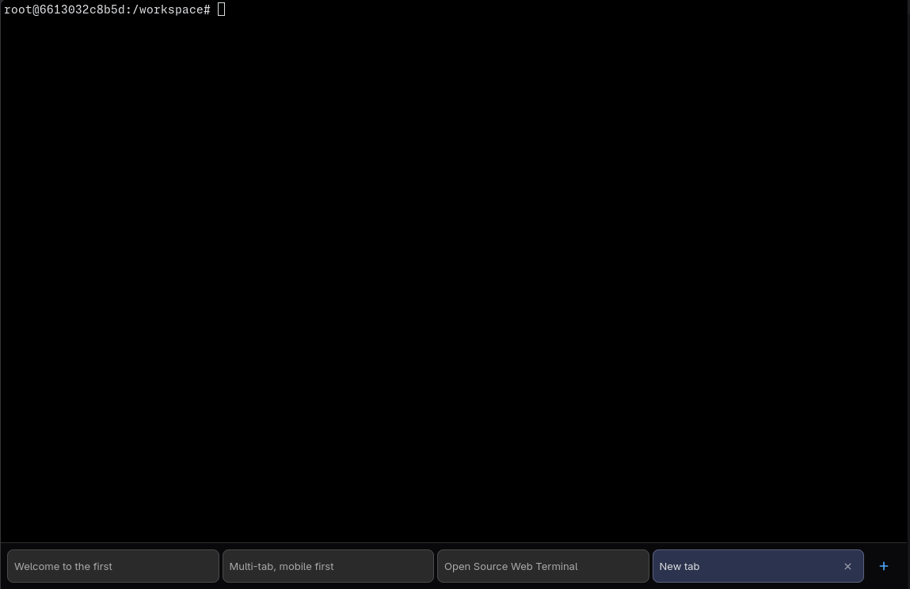

# web-terminal-server

[](https://github.com/cplieger/web-terminal-server/pkgs/container/web-terminal-server)


[](https://github.com/cplieger/web-terminal-server/actions/workflows/coverage.yml)
[](https://www.bestpractices.dev/projects/13432)
[](https://scorecard.dev/viewer/?uri=github.com/cplieger/web-terminal-server)
[](https://github.com/cplieger/web-terminal-server/releases)

A small, generic web terminal: it runs a configured command in a PTY and serves
the [`@cplieger/web-terminal-ui`](https://github.com/cplieger/web-terminal-ui)
front end over HTTP + WebSocket, built on the
[`github.com/cplieger/web-terminal-engine`](https://github.com/cplieger/web-terminal-engine)
engine. A native-touch terminal in the browser for any command, on phone and
desktop alike.

Published as a multi-arch (amd64 + arm64) container image on **GHCR** (`ghcr.io/cplieger/web-terminal-server`) and **Docker Hub** (`cplieger/web-terminal-server`).



## ⚠️ Security: this is a remote shell

Anyone who can reach the server **and pass auth (if configured)** gets an
interactive process running `WT_CMD` with this server's privileges. Treat it
like exposing SSH.

- **The binary binds `127.0.0.1` by default.** Reachable only from the same
  host until you change `WT_ADDR`.
- **The container image binds `:7681`** (it has to, to be reachable via a
  published port) and so is **unauthenticated and network-exposed by default**.
  Before exposing it beyond a trusted host, do **one** of:
  - set `WT_PASSWORD` (enables HTTP Basic auth on every route, including the
    WebSocket handshake), and/or
  - front it with an authenticating reverse proxy (Caddy + forward-auth,
    oauth2-proxy, Authentik, …), and/or
  - keep the published port bound to loopback / a private network only.
- The server logs a loud warning at startup when it is listening on a
  non-loopback address without `WT_PASSWORD` set.
- **DNS rebinding reaches even loopback binds** through your own browser: an
  attacker's page makes its hostname resolve to this server, and same-origin
  checks then pass because `Origin` and `Host` agree. Set `WT_ALLOWED_HOSTS`
  to the exact hostnames you browse to (rejects every other `Host`), or set
  `WT_PASSWORD` (the attacker's page cannot present credentials). The server
  warns at startup when neither is set.

Built-in Basic auth is a convenience for simple setups; a reverse proxy with
real identity is the recommended posture for anything internet-facing. The
process runs as the container user (root by default); restrict it with a
non-root `WT_CMD` target, a read-only root filesystem, dropped capabilities,
and a scoped work directory as your threat model requires.

## Run

```sh
docker run --rm -p 127.0.0.1:7681:7681 \
  -e WT_PASSWORD=changeme \
  -v "$PWD":/work -e WT_WORKDIR=/work \
  ghcr.io/cplieger/web-terminal-server
```

Open <http://127.0.0.1:7681>. The example binds the published port to loopback
and sets a password; adjust for your environment.

## Configuration reference

All configuration is via environment variables. Where the binary and image
defaults differ, the Default column shows them as binary / image.

| Variable | Description | Default |
| --- | --- | --- |
| `WT_ADDR` | Listen address. The binary defaults to loopback; the image must listen on all interfaces. | `127.0.0.1:7681` / `:7681` |
| `WT_LOG_LEVEL` | Log verbosity: `debug`, `info`, `warn`, or `error` (case-insensitive; slog offset syntax like `warn+1` also parses). An unparseable value falls back to `info` with a startup warning. | `info` |
| `WT_CMD` | Command to run in the PTY, whitespace-split (use a wrapper script for complex commands). | `/bin/bash` |
| `WT_WORKDIR` | Working directory for the command. Must be an existing directory if set. | _(process default)_ |
| `WT_SCROLLBACK` | Lines of scrollback the server retains for reconnect replay. | `5000` |
| `WT_IDLE_REAPER` | Go duration (e.g. `30m`); when > 0, idle sessions are reaped after this long. | _(unset → disabled)_ |
| `WT_USERNAME` | Basic-auth username (only used when `WT_PASSWORD` is set). | `admin` |
| `WT_PASSWORD` | Basic-auth password. When set, every route (including `/ws`) requires it. | _(unset → no auth)_ |
| `WT_ALLOWED_HOSTS` | Comma-separated exact hostnames/IPs the server answers for; any other `Host` header is rejected (the DNS-rebinding guard; see the security warning above). Loopback requests are always admitted, so the image healthcheck keeps working. | _(unset)_ |
| `WT_TRUSTED_PROXIES` | Comma-separated reverse-proxy CIDRs / bare IPs whose `X-Forwarded-For` the access log trusts to resolve `client_ip`. See [Client IP logging](#client-ip-logging). | _(unset → socket peer)_ |

Endpoints: `/` (UI), `/ws?session=<id>` (per-session terminal WebSocket), `/api/sessions` (create/list/close), `/api/sessions/events` (status SSE), `/healthz` (readiness).

### Client IP logging

The access log records a `client_ip` per request. By default (`WT_TRUSTED_PROXIES` unset) it logs the direct socket peer and ignores any `X-Forwarded-For` header, so the logged IP cannot be spoofed; that's the correct choice when the server is directly exposed. Behind a reverse proxy the socket peer is the proxy, not the user, so set `WT_TRUSTED_PROXIES` to the proxy's address(es), a comma-separated list of CIDRs or bare IPs (e.g. `WT_TRUSTED_PROXIES=10.0.0.0/8,192.0.2.10`), and the log resolves the real client from a trusted `X-Forwarded-For`. Only a request whose socket peer is inside the set has its `X-Forwarded-For` trusted (spoof-safe); a malformed entry is logged and skipped rather than aborting startup. Log timestamps are UTC regardless of the container's `TZ`, so lines stay zone-stable for ingest.

## Related projects

The web-terminal family:

- [`web-terminal-engine`](https://github.com/cplieger/web-terminal-engine): the
  Go session engine + TypeScript browser renderer this server embeds.
- [`@cplieger/web-terminal-ui`](https://github.com/cplieger/web-terminal-ui):
  the touch-first browser UI this server ships to the client.

Apps built on the same engine:

- [`vibekit`](https://github.com/cplieger/vibekit): a chat-first browser front end for the Kiro CLI (chat history, MCP, editor, git/forge workflows).
- [`web-terminal-kiro`](https://github.com/cplieger/web-terminal-kiro): a touch-first, multi-tab browser terminal wired to the Kiro CLI (`kiro-cli`), on desktop or phone.

## Contributing

Issues and PRs are welcome. See [CONTRIBUTING.md](CONTRIBUTING.md) for the
conventions and how to run the checks locally.

## Disclaimer

This project is built with care and follows security best practices, but it is intended for personal / self-hosted use. No guarantees of fitness for production environments. Use at your own risk.

This project was built with AI-assisted tooling using [Claude](https://claude.com), [GPT](https://openai.com), and [Kiro](https://kiro.dev). The human maintainer defines architecture, supervises implementation, and makes all final decisions.

## License

GPL-3.0. See [LICENSE](LICENSE).
