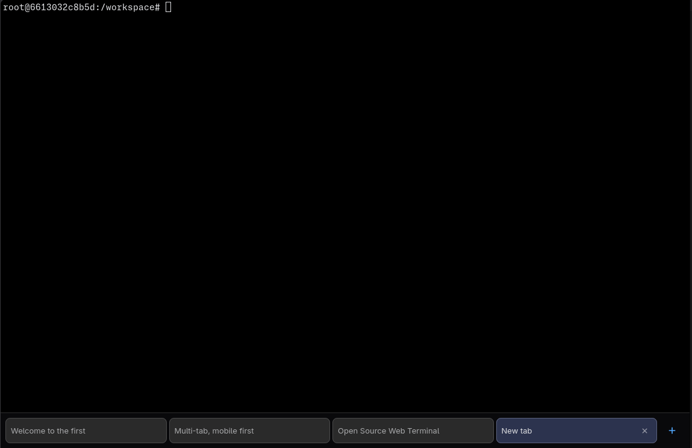

# web-terminal-server

[](https://github.com/cplieger/web-terminal-server/pkgs/container/web-terminal-server)


[](https://github.com/cplieger/web-terminal-server/actions/workflows/coverage.yml)
[](https://www.bestpractices.dev/projects/13432)
[](https://scorecard.dev/viewer/?uri=github.com/cplieger/web-terminal-server)
[](https://github.com/cplieger/web-terminal-server/releases)

A small, generic web terminal: it runs a configured command in a PTY and serves
the [`@cplieger/web-terminal-ui`](https://github.com/cplieger/web-terminal-ui)
front end over HTTP + WebSocket, built on the
[`github.com/cplieger/web-terminal-engine`](https://github.com/cplieger/web-terminal-engine)
engine. A native-touch terminal in the browser for any command, on phone and
desktop alike.

Published as a multi-arch (amd64 + arm64) container image on **GHCR** (`ghcr.io/cplieger/web-terminal-server`) and **Docker Hub** (`cplieger/web-terminal-server`).



## ⚠️ Security: this is a remote shell

Anyone who can reach the server **and pass auth (if configured)** gets an
interactive process running `WT_CMD` with this server's privileges. Treat it
like exposing SSH.

- **The binary binds `127.0.0.1` by default.** Reachable only from the same
  host until you change `WT_ADDR`.
- **The container image binds `:7681`** (it has to, to be reachable via a
  published port) and so is **unauthenticated and network-exposed by default**.
  Before exposing it beyond a trusted host, do **one** of:
  - set `WT_PASSWORD` (enables HTTP Basic auth on every route, including the
    WebSocket handshake), and/or
  - front it with an authenticating reverse proxy (Caddy + forward-auth,
    oauth2-proxy, Authentik, …), and/or
  - keep the published port bound to loopback / a private network only.
- The server logs a loud warning at startup when it is listening on a
  non-loopback address without `WT_PASSWORD` set.
- Each session's recent output (200 lines) is kept in the browser's `localStorage` by default so a
  reloaded tab does not refill over the wire. It is readable from that browser without
  passing `WT_PASSWORD` and outlives the tab; set `WT_PERSIST_SCROLLBACK=false` on a
  shared device or where storing command output at rest is unacceptable. See
  [Persisted scrollback](#persisted-scrollback).
- **DNS rebinding reaches even loopback binds** through your own browser: an
  attacker's page makes its hostname resolve to this server, and same-origin
  checks then pass because `Origin` and `Host` agree. Set `WT_ALLOWED_HOSTS`
  to the exact hostnames you browse to (rejects every other `Host`), or set
  `WT_PASSWORD` (the attacker's page cannot present credentials). The server
  warns at startup when neither is set.

Built-in Basic auth is a convenience for simple setups; a reverse proxy with
real identity is the recommended posture for anything internet-facing. The
process runs as the container user (root by default); restrict it with a
non-root `WT_CMD` target, a read-only root filesystem, dropped capabilities,
and a scoped work directory as your threat model requires.

## Run

```sh
docker run --rm -p 127.0.0.1:7681:7681 \
  -e WT_PASSWORD=changeme \
  -v "$PWD":/work -e WT_WORKDIR=/work \
  ghcr.io/cplieger/web-terminal-server
```

Open <http://127.0.0.1:7681>. The example binds the published port to loopback
and sets a password; adjust for your environment.

## Configuration reference

All configuration is via environment variables. Where the binary and image
defaults differ, the Default column shows them as binary / image.

| Variable | Description | Default |
| --- | --- | --- |
| `WT_ADDR` | Listen address. The binary defaults to loopback; the image must listen on all interfaces. | `127.0.0.1:7681` / `:7681` |
| `WT_LOG_LEVEL` | Log verbosity: `debug`, `info`, `warn`, or `error` (case-insensitive; slog offset syntax like `warn+1` also parses). An unparseable value falls back to `info` with a startup warning. | `info` |
| `WT_CMD` | Command to run in the PTY, whitespace-split (use a wrapper script for complex commands). | `/bin/bash` |
| `WT_WORKDIR` | Working directory for the command. Must be an existing directory if set. | _(process default)_ |
| `WT_SCROLLBACK` | Lines of history the server retains per session — how far back a user can scroll, and what a reconnect can replay. Kept in memory and grown as history is produced, so a large value costs nothing until a session actually reaches it: to say "never truncate", set a number no session will hit. `0` retains nothing beyond the live screen. Values between `1` and `2000` are raised to `2001` with a warning, because at or below the depth a reconnect replays in full there is nothing left to page for, so the browser falls back to holding its whole buffer — asking for less server history would cost the phone more. | `100000` |
| `WT_PERSIST_SCROLLBACK` | Keep each session's recent scrollback in the browser's `localStorage`, so a reloaded or browser-discarded tab resumes with a delta instead of refilling its whole buffer over the wire. Set `false` to turn it off — see [Persisted scrollback](#persisted-scrollback). | `true` |
| `WT_IDLE_REAPER` | Go duration (e.g. `30m`); when > 0, idle sessions are reaped after this long. | _(unset → disabled)_ |
| `WT_USERNAME` | Basic-auth username (only used when `WT_PASSWORD` is set). | `admin` |
| `WT_PASSWORD` | Basic-auth password. When set, every route (including `/ws`) requires it. | _(unset → no auth)_ |
| `WT_ALLOWED_HOSTS` | Comma-separated exact hostnames/IPs the server answers for; any other `Host` header is rejected (the DNS-rebinding guard; see the security warning above). Loopback requests are always admitted, so the image healthcheck keeps working. | _(unset)_ |
| `WT_TRUSTED_PROXIES` | Comma-separated reverse-proxy CIDRs / bare IPs whose `X-Forwarded-For` the access log trusts to resolve `client_ip`. See [Client IP logging](#client-ip-logging). | _(unset → socket peer)_ |

Endpoints: `/` (UI), `/ws?session=<id>` (per-session terminal WebSocket), `/api/sessions` (create/list/close), `/api/sessions/{id}/pinned-title` (name a terminal; `PUT` to set, `DELETE` to go back to the automatic name), `/api/sessions/events` (status SSE), `/healthz` (readiness).

### Naming terminals

Each terminal tab is labelled automatically: whatever is running in it (the foreground command), or the directory it sits in when the shell is idle, or the window title the program set for itself. Right-click a tab (press `F2`, or double-click it) to type your own name instead, which then sticks for the life of that terminal and shows on every device you have the page open on. The same menu offers **Use automatic name** to remove it again.

Names live on the server, not in your browser, so they survive a reload and are the same in every window.

### Persisted scrollback

On by default. Set `WT_PERSIST_SCROLLBACK=false` to turn it off.

What it does: the browser keeps the newest 200 lines of each session, so a reload
asks the server only for what was printed while the page was gone. Without it the
terminal comes back holding nothing and pulls the whole retained scrollback back
over the wire — you see the history filling in, and on a phone that is the normal
case rather than an edge case, because iOS discards backgrounded tabs under memory
pressure and returning to one re-runs the page. A warm reconnect and switching
between tabs in one page already replay nothing, so this only changes the
fresh-load case.

What it stores, which is the reason there is a switch at all: up to 200 lines of
each session's output, in this origin's `localStorage`, and at most about 1 MB in
total across every session. That is readable from that
browser without reaching this server and without passing `WT_PASSWORD`, and it
outlives the tab that produced it — an entry is deleted when you close its
terminal, and otherwise after seven days. `WT_CMD` decides what ends up in there.

Most ways to read it also hand over a live shell, so the snapshot is rarely the
weakest thing available. The exception worth knowing is a window where the snapshot
is readable and the shell is not: a laptop off the VPN, a stopped container, an
expired credential. **Turn it off on a shared or borrowed device, or where storing
command output at rest is not acceptable.**

Nothing is ever sent anywhere: the server neither reads nor receives these
snapshots, and it does not know whether a browser kept one. No permission prompt is
involved — `localStorage` needs none — and a browser that blocks site data, or a
private window, simply restores nothing and replays over the wire as before.

Restored content is checked against the running server on the first reconnect and
cleared if it came from a previous run, which covers the confusing case: a restarted
server numbers its output from the beginning again. If that session is already gone
— which is what a restart usually leaves — the restore is discarded outright rather
than shown behind a “Session ended” banner.

### Client IP logging

The access log records a `client_ip` per request. By default (`WT_TRUSTED_PROXIES` unset) it logs the direct socket peer and ignores any `X-Forwarded-For` header, so the logged IP cannot be spoofed; that's the correct choice when the server is directly exposed. Behind a reverse proxy the socket peer is the proxy, not the user, so set `WT_TRUSTED_PROXIES` to the proxy's address(es), a comma-separated list of CIDRs or bare IPs (e.g. `WT_TRUSTED_PROXIES=10.0.0.0/8,192.0.2.10`), and the log resolves the real client from a trusted `X-Forwarded-For`. Only a request whose socket peer is inside the set has its `X-Forwarded-For` trusted (spoof-safe); a malformed entry is logged and skipped rather than aborting startup. Log timestamps are UTC regardless of the container's `TZ`, so lines stay zone-stable for ingest.

A terminal that successfully attaches (the `/ws` WebSocket handshake) gets no line: the handshake ends the HTTP exchange, so the line could only be written when the socket finally closes, reporting a session-long duration and a status the server never sent. A handshake that is _refused_ is logged with its real status — a rejected `Host`, a cross-origin request, missing credentials, a plain HTTP request with no upgrade headers — so that is what to grep when a browser cannot attach.

## Related projects

The web-terminal family:

- [`web-terminal-engine`](https://github.com/cplieger/web-terminal-engine): the
  Go session engine + TypeScript browser renderer this server embeds.
- [`@cplieger/web-terminal-ui`](https://github.com/cplieger/web-terminal-ui):
  the touch-first browser UI this server ships to the client.

Apps built on the same engine:

- [`vibekit`](https://github.com/cplieger/vibekit): a chat-first browser front end for the Kiro CLI (chat history, MCP, editor, git/forge workflows).
- [`web-terminal-kiro`](https://github.com/cplieger/web-terminal-kiro): a touch-first, multi-tab browser terminal wired to the Kiro CLI (`kiro-cli`), on desktop or phone.

## Contributing

Issues and PRs are welcome. See [CONTRIBUTING.md](CONTRIBUTING.md) for the
conventions and how to run the checks locally.

## Disclaimer

This project is built with care and follows security best practices, but it is intended for personal / self-hosted use. No guarantees of fitness for production environments. Use at your own risk.

This project was built with AI-assisted tooling using [Claude](https://claude.com), [GPT](https://openai.com), and [Kiro](https://kiro.dev). The human maintainer defines architecture, supervises implementation, and makes all final decisions.

## License

MPL-2.0. See [LICENSE](LICENSE).
