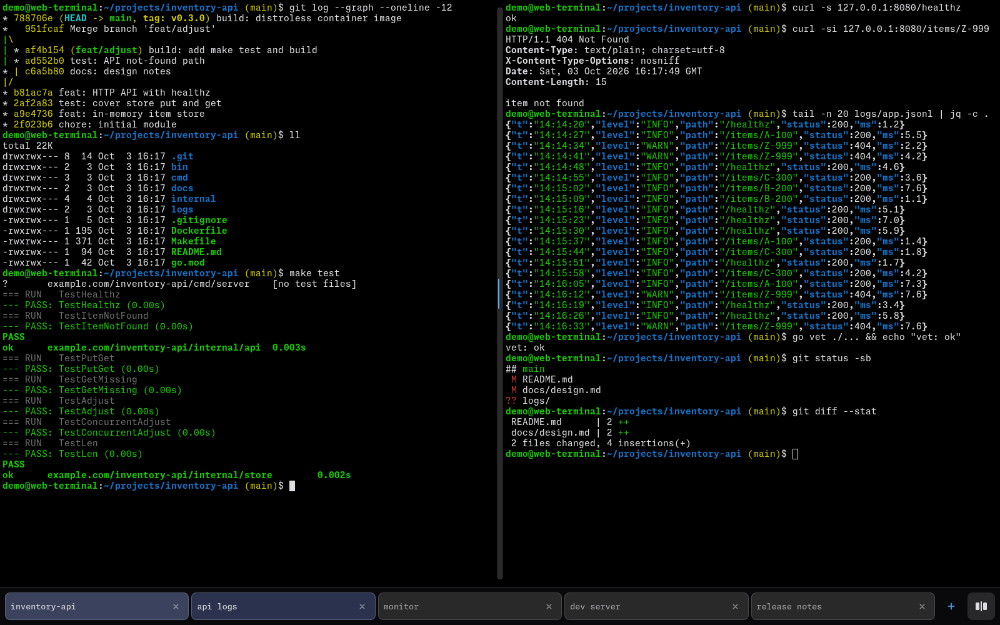

# web-terminal-server

[](https://github.com/cplieger/web-terminal-server/pkgs/container/web-terminal-server) [](https://github.com/cplieger/web-terminal-server/pkgs/container/web-terminal-server) [](https://github.com/cplieger/web-terminal-server/blob/main/Dockerfile) [](https://github.com/cplieger/web-terminal-server/issues?q=label%3Agremlins-tracker) [](https://github.com/cplieger/web-terminal-server/releases)

<!-- hub-overview BEGIN -->
web-terminal-server puts a shell in your browser, on a phone or a desktop, running in a container on your server. Each tab runs bash or a command you choose, and works on the folders you mount into the container.



## What it does

Use a terminal on your server from any browser, and pick it up again from any device.

- Gives each tab its own terminal, with a two-pane split view for two at once.
- Works on a phone, with on-screen keys for Tab, Esc, the arrows, Enter and Ctrl.
- Keeps every terminal running when you close the page, and reopens the same tabs on any device.
- Names each tab after what runs in it, or after a name you type.

## Who it is for

web-terminal-server is built for people who want a shell on their own server from a phone or a laptop, with nothing to install on them. Everyone who logs in shares the same tabs, and restarting the container ends them.

You need a Docker host, and a private network or a reverse proxy with a login in front of it.

Other tools suit a different setup:

- Consider [ttyd](https://github.com/tsl0922/ttyd) if you want a single command-line tool that shares a terminal, read-only by default.
- Consider [WeTTY](https://github.com/butlerx/wetty) if you want a browser login to SSH on any host.
- Consider [Web Terminal for Kiro](https://github.com/cplieger/web-terminal-kiro), by the same author, if you want the Kiro agent in each tab.

web-terminal-server is free software under the MPL-2.0 license.
<!-- hub-overview END -->

## Quick start

The image is on GitHub Container Registry and Docker Hub, for `amd64` and `arm64`. This is the [`compose.yaml`](compose.yaml) in this repository.

```yaml
services:
  web-terminal-server:
    image: ghcr.io/cplieger/web-terminal-server:latest
    container_name: web-terminal-server
    restart: unless-stopped
    # Required. An init at PID 1 cleans up the processes each terminal leaves behind.
    init: true

    environment:
      # Change this before the first start. Without a password there is no login.
      AUTH_PASSWORD: "your-terminal-password"
      # Every host name or IP you open the terminal at. Any other name is refused.
      ALLOWED_HOSTS: "localhost,term.example.com"
      # The folder each new terminal starts in. It must exist in the container.
      WORK_DIR: "/work"

    ports:
      # Reachable from this host only. Read README "Security" before opening it wider.
      - "127.0.0.1:7681:7681"

    volumes:
      # The container runs as root, so files created here belong to root on the host.
      - "./work:/work"
```

1. Save the file as `compose.yaml`.
2. Replace `your-terminal-password` with a password of your own.
3. Set `ALLOWED_HOSTS` to every host name or IP you will open the terminal at, for example `localhost,192.0.2.10,term.example.com`.
4. Run `docker compose up -d` in the same folder. Docker creates the `work` folder next to the file.
5. On the Docker host, open `http://localhost:7681`.
6. Log in as `admin` with your password.

Run `docker logs web-terminal-server`. You should see `web-terminal-server listening`. If the container stops with `web-terminal-server exited with error`, the `error` field of that line names the setting to fix.

The example port answers on the Docker host only. To use the terminal from a phone or another computer, put a [reverse proxy](https://github.com/cplieger/docs/blob/main/docs/reverse-proxy.md) with a login in front of it, as [Security](docs/hardening.md) describes. On a private network you can instead change the port line to `"7681:7681"` and keep the password.

## Naming and arranging terminals

Each tab is named after the command running in it, the folder an idle shell sits in, or the title a program sets. To type your own name, double-click the tab, press `F2` on it, or right-click it and choose **Rename**. **Use automatic name** in the same menu removes it again.

The split button at the end of the tab row opens a second pane. To show a tab in one pane, choose **Snap to left** or **Snap to right** in its menu, or drag it onto that half of the screen. Names and the layout are stored on the server, so every device and window shows the same tabs.

## Configuration reference

Each setting is an environment variable in `compose.yaml`. The server reads them once at start, so run `docker compose up -d` again after a change. Every setting is optional, and the defaults below are the image's.

| Variable | Description | Default |
| --- | --- | --- |
| `AUTH_PASSWORD` | Password for HTTP Basic auth on every page and terminal connection. Unset means no login. | _(unset)_ |
| `AUTH_USERNAME` | User name for that login, used only when `AUTH_PASSWORD` is set. | `admin` |
| `ALLOWED_HOSTS` | Comma-separated host names and IPs you open the terminal at. Any other host name is refused. | _(unset)_ |
| `WORK_DIR` | The folder each new terminal starts in. It must exist. | _(unset)_ |
| `SESSION_CMD` | The command each terminal runs, split on spaces. Use a script for anything more complex. | `/bin/bash` |
| `IDLE_TIMEOUT` | Close terminals nobody has had open for this long, as a duration such as `30m`. | _(unset)_ |
| `PERSIST_SCROLLBACK` | Keep each tab's newest 200 lines in the browser, so a reloaded page fills in faster. `false` turns it off. | `true` |
| `SCROLLBACK` | Lines of history kept per terminal on the server. | `100000` |
| `TRUSTED_PROXIES` | Reverse-proxy CIDRs or IPs whose `X-Forwarded-For` the access log trusts to name the real client. | _(unset)_ |
| `LISTEN_ADDR` | Listen address as `host:port`. Keep the host part empty so the healthcheck can still reach it. | `:7681` |
| `LOG_LEVEL` | `debug`, `info`, `warn` or `error`. An unknown value falls back to `info` with a warning. | `info` |

[Configuration](docs/configuration.md) has the details of each setting.

| Mount | Description |
| --- | --- |
| _(any path)_ | Nothing is required. Mount what the terminals should reach and point `WORK_DIR` at it. |

| Port | Description |
| --- | --- |
| `7681` | The web page, the terminal API and the terminal connections |

## Security

Whoever passes the login gets a shell inside the container, as root by default. Treat the port like SSH. The image listens on every interface inside the container, so the published port decides who reaches it.

- Set `AUTH_PASSWORD`, or put a reverse proxy with its own login in front. Failed logins are rate-limited.
- Set `ALLOWED_HOSTS` to the exact names you open it at. With neither it nor a password, a malicious web page can reach even a loopback-only terminal through your browser, a trick called DNS rebinding.
- Anyone who has a terminal's id in `/ws?session=<id>` can join it. Keep that query string out of your proxy's access log.
- The browser keeps each tab's newest 200 lines for up to seven days, readable by anyone using that browser without the password. Set `PERSIST_SCROLLBACK=false` on a shared device.

[Security](docs/hardening.md) covers the reverse proxy, the stored lines, hardening and what the image contains.

## Troubleshooting

The healthcheck asks `/healthz` on `127.0.0.1` every 30 seconds, after a 15-second start period. It answers `200` once the server listens and `503` while it starts or shuts down. Docker does not restart the container for it, so `docker ps` shows `unhealthy` while the container keeps running.

- `docker ps` shows `unhealthy` while the page works. `LISTEN_ADDR` names one interface. Keep its host part empty, as in `:7681`.
- The log warns that the server runs as PID 1. Add `init: true` to the service, or `--init` to `docker run`.
- The browser shows `host not allowed`. Add that host name to `ALLOWED_HOSTS`.
- The container stops with `web-terminal-server exited with error`. Its `error` field names the problem and its `stage` field names the step that failed.

[How it works](docs/how-it-works.md) lists every startup stage and what the logs record.

## Documentation

- [Configuration](docs/configuration.md) explains every setting, the mounts and the ports.
- [Security](docs/hardening.md) covers the reverse proxy, the lines stored in the browser, hardening and what the image contains.
- [How it works](docs/how-it-works.md) covers sessions, startup failures, the logs and the healthcheck.

## Credits

The terminal is [web-terminal-engine](https://github.com/cplieger/web-terminal-engine) and [web-terminal-ui](https://github.com/cplieger/web-terminal-ui), both by the same author. Its text font is [Monaspace](https://github.com/githubnext/monaspace) Neon NF, by GitHub Next.

## Contributing

See [CONTRIBUTING.md](CONTRIBUTING.md).

## Disclaimer

This project is built with care and follows security best practices, but it is intended for personal / self-hosted use. No guarantees of fitness for production environments. Use at your own risk.

This project was built with AI-assisted tooling using [Claude](https://claude.com), [GPT](https://openai.com), and [Kiro](https://kiro.dev). The human maintainer defines architecture, supervises implementation, and makes all final decisions.

## License

MPL-2.0. See [LICENSE](LICENSE). The image carries the license text of every bundled component under `/usr/share/licenses/`.

The image redistributes two web fonts under their own licences, each served beside the font it covers. Monaspace Neon NF is under the SIL Open Font License 1.1 (`/vendor/fonts/MonaspaceNeonNF-LICENSE`). Web Terminal Glyphs, the tiling overlay listed ahead of it, is under Apache-2.0 (`/vendor/fonts/WebTerminalGlyphs-LICENSE`, with its `/vendor/fonts/WebTerminalGlyphs-NOTICE`).
